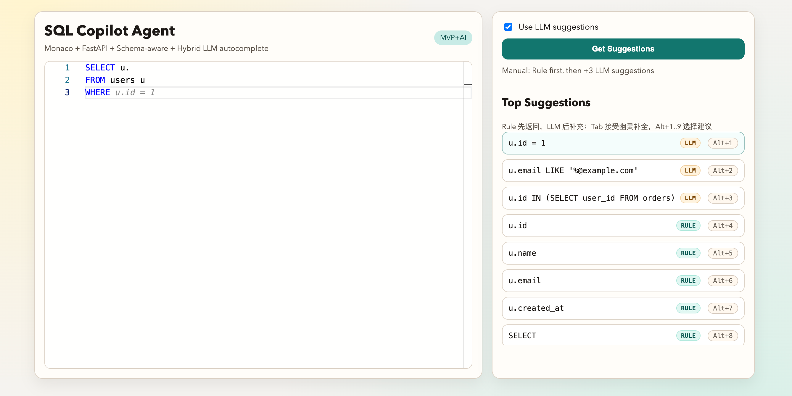

# SQL Copilot Agent

AI 驱动的 SQL 自动补全与查询助手（MVP+AI）。
Repository: [hyphy-void/sql-copilot-agent](https://github.com/hyphy-void/sql-copilot-agent)

[](https://www.python.org/)
[](https://fastapi.tiangolo.com/)
[](https://microsoft.github.io/monaco-editor/)
[](https://www.langchain.com/langgraph)
[](https://www.sqlite.org/index.html)
[](https://platform.openai.com/docs/api-reference)



## Features

- SQL AST 解析（`sqlglot`）
- Schema 感知补全（SQLite introspection）
- Alias 识别（`users u` -> `u.id`）
- 规则补全 + LLM 语义补全（OpenAI，可自动降级）
- LangGraph 工作流（Parse -> Schema -> LLM -> Rank）
- Monaco 最小可用前端

## Project Structure

```text
sql-copilot-agent
├── backend
│   ├── main.py
│   ├── parser.py
│   ├── schema_manager.py
│   ├── context_analyzer.py
│   ├── autocomplete_engine.py
│   ├── llm.py
│   └── models.py
├── agent
│   └── graph.py
├── frontend
│   ├── index.html
│   └── monaco.js
├── .env.example
├── db
│   └── init.sql
├── tests
├── scripts
│   └── demo.sh
├── requirements.txt
└── README.md
```

## Quick Start

```bash
conda create -n sql-copilot-agent python=3.11 -y
conda activate sql-copilot-agent
pip install -r requirements.txt
cp .env.example .env
# Edit .env with your real key and model
uvicorn backend.main:app --reload
```

打开 [http://127.0.0.1:8000](http://127.0.0.1:8000)。

## .env 配置（阿里百炼示例）

### 1) 使用模板

```bash
cp .env.example .env
```

`.env` 已被 `.gitignore` 忽略，不会被提交；`.env.example` 用于团队共享模板。

### 2) 填写配置（脱敏示例）

```env
API_PROVIDER=OpenAI Compatible
BASE_URL=https://coding.dashscope.aliyuncs.com/v1
OPENAI_COMPATIBLE_API_KEY=sk-sp-****REDACTED****
MODEL_ID=qwen3.5-plus

DB_PATH=./db/demo.db
INIT_SQL_PATH=./db/init.sql
```

### 3) 字段说明

- `API_PROVIDER`：推荐 `OpenAI Compatible`
- `BASE_URL`：OpenAI Compatible 网关地址（阿里百炼示例见上）
- `OPENAI_COMPATIBLE_API_KEY`：百炼/Coding Plan API Key
- `MODEL_ID`：模型 ID（例如 `qwen3.5-plus`）
- `DB_PATH`：SQLite 数据文件路径（默认 `./db/demo.db`）
- `INIT_SQL_PATH`：初始化脚本路径（默认 `./db/init.sql`）
- 兼容旧字段：`LLM_PROVIDER` / `OPENAI_API_KEY` / `OPENAI_BASE_URL` / `OPENAI_MODEL`

没有设置 API Key（`OPENAI_COMPATIBLE_API_KEY` 或 `OPENAI_API_KEY`）时，`/autocomplete` 自动降级为规则补全并返回 `mode=rule_only`。

## API

### `GET /health`

```json
{
  "status": "ok",
  "llm_enabled": false
}
```

### `GET /schema/tables`

```json
{
  "tables": ["orders", "users"]
}
```

### `GET /schema/columns/{table}`

```json
{
  "table": "users",
  "columns": [
    {"name": "id", "type": "INTEGER", "notnull": false, "default": null, "pk": true}
  ]
}
```

### `POST /autocomplete`

Request:

```json
{
  "sql": "SELECT u. FROM users u",
  "cursor": 9,
  "max_suggestions": 10,
  "use_llm": true
}
```

Response:

```json
{
  "suggestions": ["u.id", "u.name", "u.email"],
  "mode": "rule_only",
  "debug": {
    "context": "select",
    "table": "users",
    "alias_map": {"users": "users", "u": "users"},
    "timings_ms": {
      "parse_ms": 0.3,
      "schema_ms": 0.7,
      "llm_ms": 0.0,
      "rank_ms": 0.1,
      "total_ms": 1.4
    },
    "errors": []
  }
}
```

## Run Tests

```bash
pytest -q
```

## Milestone Mapping

- 阶段1：后端规则补全 + schema 接口 + SQLite 初始化
- 阶段2：OpenAI provider + 前端 Monaco + 混合补全与降级
- 阶段3：LangGraph DAG + 耗时/错误可观测信息
- 阶段4：README + demo 脚本 + 测试验收
